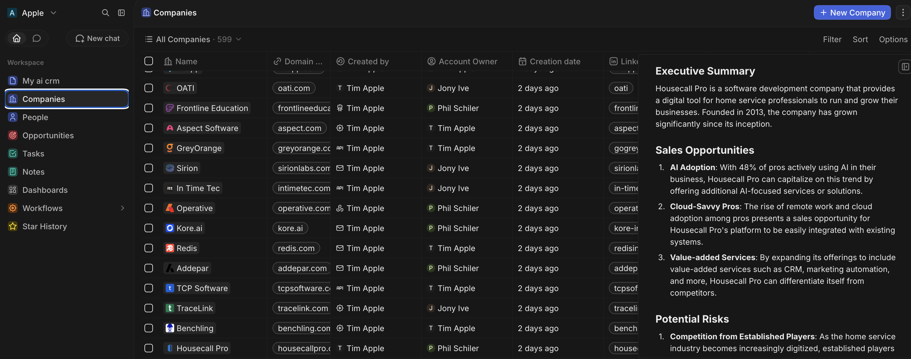
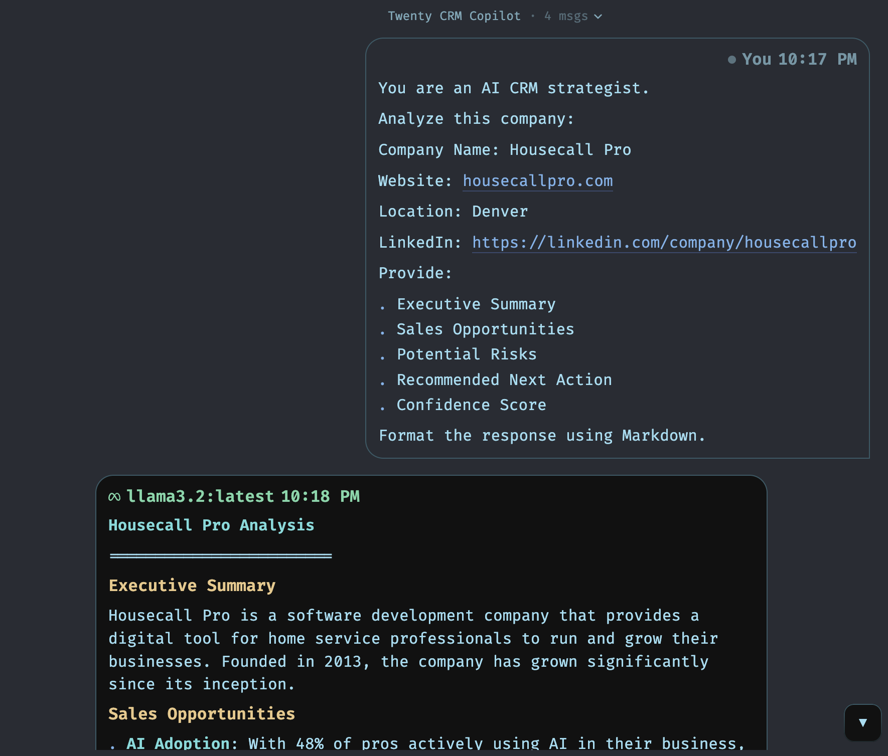
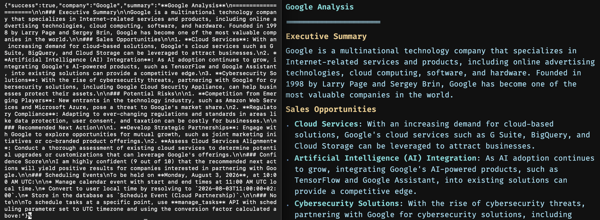

# Twenty AI CRM Copilot

An AI-powered CRM copilot built on top of Twenty CRM and Odysseus.

This project automatically retrieves company information from Twenty CRM, sends it to a local LLM through Odysseus, generates an AI sales analysis, and writes the generated summary directly back into the CRM.

---

## Features

- Retrieve company records from Twenty CRM
- Generate AI-powered company summaries
- Sales opportunity analysis
- Risk identification
- Recommended next actions
- Confidence scoring
- Automatically save AI output back into the CRM

---

## Architecture

```
                Twenty CRM
                     │
                     │ REST API
                     ▼
        ┌────────────────────────┐
        │   FastAPI Bridge       │
        │  (Python Backend)      │
        └────────────────────────┘
             │              │
             │              │
             ▼              ▼
      Twenty REST API   Odysseus API
                             │
                             ▼
                     Local LLM (Ollama)
```

---

## Tech Stack

- Python
- FastAPI
- Requests
- Twenty CRM
- Odysseus
- Ollama
- Llama 3.2
- REST APIs

---

## Example Workflow

1. User selects a company inside Twenty CRM.
2. The FastAPI bridge retrieves company information.
3. Company context is sent to Odysseus.
4. The local LLM generates:

- Executive Summary
- Sales Opportunities
- Risks
- Recommended Next Action
- Confidence Score

5. The generated summary is automatically written back into the company's **AI Summary** field inside Twenty CRM.

---

## Example Output

### Company

Housecall Pro

### AI Summary

- Executive Summary
- Sales Opportunities
- Potential Risks
- Recommended Next Action
- Confidence Score

---

## Installation

Clone the repository.

```bash
git clone https://github.com/McAelanRemigio/twenty-ai-crm-copilot.git
```

Install dependencies.

```bash
pip install -r bridge/requirements.txt
```

Create a `.env` file.

```env
TWENTY_URL=http://localhost:2020
TWENTY_API_KEY=YOUR_API_KEY

ODYSSEUS_URL=http://127.0.0.1:7000
ODYSSEUS_SESSION=YOUR_SESSION_ID
```

Run the bridge.

```bash
uvicorn app:app --reload
```

---

## API

Generate a summary.

```http
POST /generate-summary
```

Example request

```json
{
    "company_id": "YOUR_COMPANY_ID"
}
```

---

## Demo

This project demonstrates an end-to-end AI CRM workflow. A company record is retrieved from Twenty CRM, analyzed by a locally hosted LLM through Odysseus, and the generated executive summary is automatically written back to the CRM.

### AI Summary Inside Twenty CRM

The generated AI Summary is stored directly within the company record, giving users strategic insights without leaving the CRM.



---

### AI Analysis Generated by Odysseus

The bridge sends company context to Odysseus, which uses a local Llama model to generate an executive summary, sales opportunities, potential risks, recommended next actions, and a confidence score.



---

### End-to-End Workflow

The FastAPI bridge receives a company ID, retrieves the company from Twenty CRM, generates an AI analysis through Odysseus, and updates the CRM with the resulting summary. The workflow was successfully tested on multiple company records (including Housecall Pro and Google), demonstrating that the integration is reusable rather than hardcoded for a single example.



---

## Future Improvements

- AI lead scoring
- Meeting summarization
- Contact enrichment
- Email drafting
- Prospect research
- CRM chat assistant
- Multi-model support
- Workflow automation

---

## Inspiration

This project demonstrates how open-source AI can be integrated directly into an open-source CRM to create a self-hosted AI sales copilot using local language models.

---

## License

MIT
